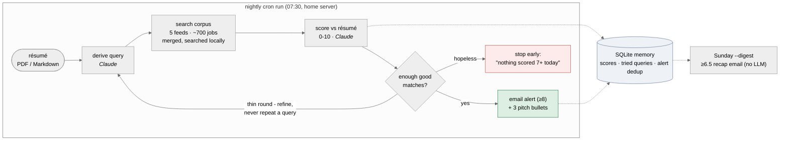

# Job Scout Agent

Author: Blake Simpson | Track: Track 3 — Agent | Date: 2026-07-26 | GitHub: https://github.com/EXC3ll3NTrhyTHM/agent-workflow

## Section 1: Introduction

**What problem did I tackle?** Job hunting is a volume problem handled with
human attention: the postings worth applying to appear unpredictably across
many boards, and finding them means re-running the same searches and
re-reading the same near-miss postings every day. Most "job alert" emails
don't help — they are keyword matches, high volume and low signal.

**Why is it interesting?** It is a real, personal problem with a natural agent
shape: the task repeats daily, requires judgment (does this posting actually
fit *this* résumé?), benefits from self-correction (bad query → try another),
and has a crisp success criterion (would I actually apply to this?). It also
forces the honest-failure question most demos skip: what should an agent do
when the right answer is "nothing today"?

**What did I build, in one paragraph?** Job Scout is an agent that runs
nightly on a home server. It derives a job-board search query from my résumé
(Claude), searches a ~700-posting corpus merged from five public job feeds,
scores each new posting 0–10 against the résumé (Claude), and refines its
query and searches again when a round produces too few good matches — while
remembering every query it has tried. Postings scoring ≥ 8 trigger an instant
email with three Claude-drafted "why I'm a fit" bullets grounded in the
résumé; a weekly digest covers the 6.5–8 "worth a look" band. When the search
looks hopeless, it stops early and says so instead of padding the list. It
never applies to jobs on my behalf — an explicit non-goal.

**What surprised me most?** My evaluation's headline number — 17% task
success — initially read as "the agent is broken," and it wasn't. Conditioning
on feasibility showed 10 of 12 test cases had fewer than 3 relevant postings
in the entire corpus; the agent passed every case that was passable. The fix
that mattered was adding RSS feeds, not anything agentic. The evaluation
reversed my priorities, which is exactly what it was for.

## Section 2: System Design

### Architecture



The agent loop (`src/job_scout/agent.py`) is deliberately small but genuine:
it **perceives** (search + LLM scoring), **acts** (alert / digest / list-only
per posting), **remembers** (SQLite: every score, every tried query, alert
dedup), and **self-corrects** (derives a fresh query when a round comes up
thin; stops when it has enough, or when the search is provably going nowhere).

### Components

| Piece | File(s) | What it does / why this approach |
|---|---|---|
| Agent loop | `agent.py` | Plain Python; control flow is linear enough that a framework would obscure it |
| Tools | `tools.py` | `search_jobs`, `score_jobs`, `derive_query`, `draft_pitch` — plain functions; every Claude tool has a deterministic, *labelled* fallback |
| Job corpus | `jobs.py` + 5 source clients | We Work Remotely, RemoteOK, Jobicy, Working Nomads, Remotive (~700 unique postings), merged, deduplicated, searched client-side |
| LLM access | `claude_cli.py` | Shells out to the `claude` CLI; no auth code in the app — the binary manages its own credential |
| State | `db.py` (SQLite) | Ranked listings, tried queries, alert dedup, digest window; additive migrations |
| Notifications | `alerts.py` | Instant alerts + weekly digest via Gmail SMTP; dry-run mode without credentials |
| Scheduling | `scripts/install_cron.sh` | Nightly scan + weekly digest on a home server; launchd variant for laptops |
| Evaluation | `evaluation.py`, `scripts/run_eval.py` | 12-case suite with an independent LLM judge (Section 4) |

### Design decisions — and the alternatives I rejected

1. **Client-side search over a merged corpus** (rejected: trusting any
   board's server-side search). Remotive's search API was discovered in Week 4
   to be serving a stale CDN cache that *ignores the query* — verified via the
   `age` response header and identical job ids across different queries. Job
   Scout instead pulls full feeds from five sources and filters locally, so
   query refinement stays meaningful and one dead source degrades the corpus
   instead of breaking the run.
2. **Plain Python loop** (rejected: LangGraph). I planned LangGraph and
   removed it: the control flow is a linear loop with two exit conditions, and
   a graph framework added a dependency tree without adding capability. The
   loop is ~100 lines and tests offline.
3. **Claude via the CLI subprocess** (rejected: SDK + API-key management).
   The app contains zero credential-handling code; the `claude` binary
   authenticates itself and runs identically on a laptop and under cron.
4. **Honest, labelled fallbacks** (rejected: silent degradation). Every
   Claude-backed tool has a deterministic fallback whose results carry
   `source: "fallback"` — degraded runs are visible, and the fallback doubles
   as the evaluation's no-LLM baseline.
5. **Two notification tiers, alert bar at 8 not 9** (rejected: a single
   "perfect matches only" threshold). Measured score drift is ±1 run-to-run,
   so a 9 bar alerts on borderline-excellent jobs only on lucky days; the
   weekly ≥ 6.5 digest catches the worth-a-look band without nightly spam.

### Tech stack

Python 3.11+ (`requests`, `pypdf`, `python-dotenv` — deliberately minimal);
Claude via the Claude Code CLI as a subprocess; SQLite for state; Gmail SMTP
for delivery; cron for scheduling; pytest (25 offline tests, no network or
LLM needed). Five public, no-auth job feeds supply the data.

## Section 3: Implementation

**The most technically interesting part: teaching the agent to give up.**
The naive loop ("refine until you hit the round cap") burned ~6 Claude calls
per run on résumés the corpus couldn't serve, then presented weak matches
confidently. The final stop logic distinguishes *success* from two kinds of
hopelessness — and the exact thresholds came from per-round evaluation data,
not intuition (`src/job_scout/agent.py`):

```python
if n_good >= target_good:
    stop_reason = "target_met"
    break
# (a) two queries in a row surfaced nothing new — the corpus has no
#     more to offer this résumé;
dead_rounds = dead_rounds + 1 if not new_jobs else 0
if dead_rounds >= 2:
    stop_reason = "exhausted"
    break
# (b) two full rounds produced not a single good match — new postings
#     keep appearing but none are relevant.
if round_no >= 2 and n_good == 0:
    stop_reason = "exhausted"
    break
```

Rule (a) alone turned out to be nearly dead code on a 700-posting corpus —
hopeless queries find new-but-*irrelevant* postings, not nothing — which is
why rule (b) exists. A tempting stricter rule ("stop when the good-match
count fails to increase for two rounds") was rejected against the data: one
case plateaued at 2 good matches for two rounds and found its third in
round 3.

**Harder than expected #1: searching text without lying.** Plain substring
matching let "ml" hit "html" and "api" hit "therapist", quietly filling
results with garbage; and when nothing matched at all, an early version
padded results with the head of the corpus. The final matcher requires
word-start hits and returns an honest empty list (`src/job_scout/jobs.py`):

```python
# Terms match at word starts only ("api" matches "APIs" but not
# "therapist"; "ml" matches "MLOps" but not "html").
patterns = [re.compile(rf"(?<![a-z0-9]){re.escape(t)}") for t in terms]
...
if not ranked:
    return []   # honest scarcity — padding here produced confident
                # wrong top-5s (Week 6 eval, wrong-role-family misses)
```

**Harder than expected #2: degrading without deceiving.** The pipeline must
survive Claude being unavailable (rate limits, cron-host misconfiguration)
without pretending nothing happened. Every result is labelled with its
origin, so a degraded run is visible in the output, the DB, and the eval
(`src/job_scout/tools.py`):

```python
@dataclass
class ScoredJob:
    job: Job
    score: float   # 0-10 match against the résumé
    reasoning: str
    source: str    # "claude" or "fallback" — never silently swapped
```

Pointing `claude_path` at a nonexistent binary drives every tool down its
fallback path — turning "the agent without Claude" into a one-line ablation
for the evaluation.

**Shortcuts and simplifications, deliberately taken:**

- Keyword search with hand-tuned field weights instead of embeddings — good
  enough once term matching was fixed, and fully debuggable.
- One batched scoring call for all ~8 postings in a round instead of one call
  per posting — cheaper, faster, and the model sees candidates side-by-side.
- A process-level corpus cache (feeds fetched once per run, re-filtered per
  query) instead of a job database with freshness tracking.
- Single-host SQLite state; running the schedule on two hosts would
  double-alert. Documented rather than solved.
- The optional stretch goals (résumé-upload web UI, chat over stored
  postings) were skipped in favor of evaluation and the fixes it demanded.

## Section 4: Evaluation

### Setup

**Test set:** 12 cases in `tests/eval_cases.json`, each a hand-written résumé
fixture plus an explicit relevance rubric (what counts as relevant for this
profile; which near-misses don't). Ten realistic profiles (backend, frontend,
data analyst, DevOps/SRE, ML, mobile, security, data engineer, QA, product
manager), one coverage probe (technical writer — a role thin in tech-focused
feeds), one edge case (career-changer with weak professional signal).

**Arms:** each case runs three ways — **full** (the real agent), **round1**
(the run truncated to its first round: isolates the refinement loop's value),
and **fallback** (Claude disabled: isolates LLM judgment's value).

**Judging:** the agent's scorer cannot grade its own homework. An independent
LLM judge applies each case's rubric as a binary relevant/not-relevant call
per surfaced posting, with a failure category for misses (wrong-role-family,
adjacent-stack, seniority-mismatch, too-generic, non-engineering). Judge and
scorer prompts share no text. A 30-judgment manual spot-check agreed 28/30,
and both disagreements were strict calls (they lower the agent's numbers).

**Metrics** (per Track 3 guidance): task success (≥3 of top-5 judged
relevant), precision@5, step efficiency (rounds used, early-stop rate), error
recovery (of cases where round 1 wasn't enough, how many refinement rescued).

### Main results

The Week 6 run (241-posting corpus) diagnosed the system; Week 7 fixed the
three findings and re-ran the same 12 cases (710-posting corpus, 2026-07-25):

| Arm | Task success | Mean P@5 | Mean rounds | Early-stop | Error recovery |
|---|---|---|---|---|---|
| full (Wk 6 → Wk 7) | 2/12 → **8/12 (67%)** | 0.32 → **0.65** | 2.8 → 2.1 | 8% → 67% | 1/11 → 5/9 |
| round1 (no refinement) | 2/12 → 7/12 | 0.27 → 0.55 | 1.0 | — | — |
| fallback (no Claude) | 1/12 → 7/12 | 0.20 → 0.48 | 3.0 → 2.0 | — | — |

Feasibility-conditioned: cases where ≥3 relevant postings existed went from
2 to 8, and the agent passed **8/8** — it has passed every passable case in
both runs.

### Representative examples

1. **python_backend (success, and the refinement loop earning its keep).**
   Round 1 found 2 good matches; the agent refined twice ("python backend
   django", then "python microservices kubernetes") and found its third in
   round 3 — final P@5 1.00. This case also vetoed a stricter stop rule: its
   good-match count plateaued for two rounds before the win.
2. **product_manager (success; LLM judgment beats keywords where it's hard).**
   Claude P@5 1.00 vs keyword fallback 0.80, and in Week 6's starved corpus
   0.60 vs 0.20 — keyword overlap cannot tell a PM role from product-adjacent
   engineering roles; the LLM can.
3. **technical_writer (honest failure — the proudest failure in the
   project).** Zero relevant postings existed in the corpus. The derived
   queries were exactly right; the agent scored two rounds, found nothing
   good, and stopped: *"nothing scored 7+ today."* Before the Week 7 fixes,
   this same case produced a confident, entirely wrong top-5.
4. **devops_sre (Week 6: the keyword baseline beat the agent, 0.80 vs 0.60).**
   Claude ranked a generic "Senior Software Engineer" posting above a fourth
   relevant DevOps role — adjacent-stack inflation. The Week 7 prompt
   calibration ("different role family caps at 3") addressed exactly this;
   both arms now score 1.00 on the case.
5. **career_changer (edge case: graceful degradation).** Mixed teaching/
   bootcamp signal, only 2 relevant postings in the corpus — the agent put
   both in its top-5 and still failed the ≥3 bar. The failure is real but
   it is a supply failure; the ranking was right.

### What the numbers say

The headline gain came from supply, and the eval says so honestly: the
no-Claude baseline also jumped (1/12 → 7/12) purely from the corpus fix. On
top of that, the agentic parts separate from the baseline where judgment is
hard: +0.17 mean P@5 over keyword scoring, +1 task success and +0.10 P@5 over
the no-refinement ablation, 5/9 error recovery. In every one of the four
remaining failures, the agent's top-5 contained *every* relevant posting that
existed — residual misses are pure supply, not ranking. The surprise worth
naming: measuring step efficiency exposed real waste (a discarded
`derive_query` call every full-length run; re-scoring postings that
reappeared across rounds) that reading the code never surfaced.

## Section 5: Limitations & Failure Analysis

**What the system does poorly, specifically:**

- **Thin-supply profiles fail.** Mobile, data engineering, technical writing
  and junior/career-change roles had 0–2 relevant postings in a 710-posting
  corpus; no ranking can fix that. Root cause: all five feeds skew
  English-language, remote, tech-and-senior. This is the #1 thing I would fix
  next: per-profile source selection (writing-focused boards for a writer's
  résumé) rather than one shared corpus.
- **Scores drift ±1 between runs** (measured in Week 4), so a 7.9 tonight can
  be an 8.2 tomorrow — borderline alerts are timing-dependent, and single-run
  eval numbers on borderline cases can flip. Root cause: sampling an LLM for
  integer scores. Mitigations in place (alert bar at 8, digest tier catching
  6.5+); a rolling per-posting score average would be the real fix.
- **The judge is also Claude.** Disjoint prompts, hand-written rubrics and the
  28/30 spot-check mitigate a shared blind spot; they don't eliminate it. A
  human-labelled subset each run would.
- **Hopelessness detection is conservative by design.** data_engineer and
  career_changer still burn all 3 rounds because one early good match makes
  the search not-provably-hopeless. Correct per the data I have, but it means
  "hopeless" savings only apply to fully-dry cases.
- **Single-host state.** Alert dedup lives in one SQLite file; two hosts would
  double-alert. Fine for a personal tool, a real constraint for anything more.

## Section 6: Reflection

**Top 3 things I learned:**

1. **Evaluate before optimizing.** The eval reversed my roadmap — I expected
   to spend Week 7 on prompts and loop logic; the data said "add RSS feeds."
   The fix that moved success from 2/12 to 8/12 was mostly not AI work.
2. **Condition metrics on feasibility.** 17% success meant "starved," not
   "broken." Without asking "was success even possible per case?", I would
   have fixed the wrong layer.
3. **Design the failure path as carefully as the success path.** Search
   fallback, curve-grading scorer, always-full top-5 — each layer individually
   chose "return something," and the composition produced confident nonsense.
   "Nothing today" has to be a first-class outcome, in the UI and in the
   agent's stop logic.

**What I would do differently:** build the evaluation harness in Week 3-4,
not Week 6 — every design argument I had with myself (thresholds, rounds,
stop rules) became empirical the day the harness existed. I would also add
the second and third job sources immediately rather than treating the corpus
as a solved problem after the Remotive workaround.

**What a v2 looks like:** per-profile source selection; embedding-based
retrieval to replace keyword search (now that the eval can measure whether it
helps); a rolling score average to dampen drift; the résumé-upload web UI and
chat-over-postings stretch goals; multi-user support with per-user corpora
and state.

**Advice for someone starting this project:** pick a data source you can
*verify*, and verify it early — my biggest schedule risk was a job board
silently ignoring search queries, found only because I diffed responses. And
write the eval before you think you need it; an agent that looks great on
your own résumé can be failing 10 of 12 profiles you never tried.

## Section 7: References

- Anthropic — Claude & Claude Code CLI (LLM access via subprocess): https://claude.com/claude-code
- Remotive public jobs API: https://remotive.com/api/remote-jobs
- RemoteOK public jobs feed: https://remoteok.com/api
- Jobicy remote-jobs API: https://jobicy.com/api/v2/remote-jobs
- We Work Remotely RSS feeds: https://weworkremotely.com/remote-jobs.rss
- Working Nomads exposed-jobs API: https://www.workingnomads.com/api/exposed_jobs/
- Python libraries: requests, pypdf, python-dotenv, pytest
- Marp (Markdown slides): https://marp.app
- Course Track 3 (Agent) guidance — evaluation metrics (task success, step
  efficiency, error recovery)

## Appendix A: How to run

See README → Quickstart. Short version: `python3 -m venv .venv`,
`.venv/bin/pip install -e ".[dev]"`, copy `.env.example` → `.env` (set
`CLAUDE_PATH`, `RESUME_PATH`), then `.venv/bin/job-scout resume.pdf`.
Tests: `.venv/bin/python -m pytest tests/` (offline, no Claude needed).
Evaluation: `PYTHONPATH=src .venv/bin/python scripts/run_eval.py`.

## Appendix B: Evidence index

- `docs/evaluation.md` — full evaluation methodology + Week 6 results + §9 before/after
- `docs/eval/results.md`, `docs/eval/results.json` — final-run tables and raw judgments
- `docs/week-4-midpoint.md` — Remotive CDN diagnosis, score-stability data
- `docs/week-{3..7}-report.md` — weekly progress reports
