<!-- Final presentation deck (course template order, 10 slides + 1 backup).
     Renders as slides with Marp (VS Code: "Marp for VS Code" extension).
     Each `---` is a slide break; speaker notes are in HTML comments.
     Timed run-of-show is in the comment block on the last slide. -->

<!-- SLIDE 1: Title -->

# Job Scout Agent

### An agent that hunts jobs while you sleep

**Blake Simpson** · Track 3 — Agent

*Reads your résumé, scans five job boards nightly, and emails you only when something is genuinely worth applying to.*

github.com/EXC3ll3NTrhyTHM/agent-workflow

---

<!-- SLIDE 2: The Problem -->

## The problem

- Good postings appear unpredictably, across many boards, and go fast
- Manual hunting = re-running the same searches daily, re-reading the same near-misses
- Existing "job alerts" are keyword matches: high volume, low signal

**The user:** a job seeker who wants *passive, high-signal* discovery.
Your résumé is the standing search. An email from the system means **worth your attention tonight**. It never applies on your behalf.

---

<!-- SLIDE 3: System Architecture — walk through in 90 seconds -->

## Architecture — one nightly cron run



<!-- 90s: résumé in → Claude derives query → local search over 5 merged
     feeds → Claude scores each NEW posting → ≥8 alerts with pitch bullets →
     thin round = refine and retry → hopeless = stop honestly.
     Plain Python loop, no framework. Claude via CLI subprocess: zero auth
     code. Everything tests offline. -->

---

<!-- SLIDE 4: Live Demo, success case 1 -->

## Live demo 1 — my résumé

```
$ job-scout resume.pdf
```

Watch for the agent behaviors:

1. Derives a query from the résumé — no keywords from me
2. Scores only *new* postings against it
3. Thin round → **refines its own query** (and never repeats one)
4. Stops the moment it has 3 good matches
5. ≥8 → the alert email, with three "why I'm a fit" bullets

<!-- Narrate DURING Claude latency; flip back to slide 3 while it runs.
     End on the ranked list + the alert-email screenshot. -->

---

<!-- SLIDE 5: Live Demo, success case 2 -->

## Live demo 2 — someone else's résumé

```
$ job-scout tests/fixtures/resume_product_manager.md
```

A non-engineering profile — same agent, zero configuration.

Why this case is interesting: keyword matching **can't** tell a product
manager role from product-adjacent engineering roles. LLM scoring can —
P@5 1.00 vs 0.80 for the keyword baseline (0.60 vs 0.20 on the starved
Week 6 corpus).

<!-- Pre-run output in the second terminal if time is tight —
     narrate from it rather than waiting live. -->

---

<!-- SLIDE 6: A Failure Case -->

## A failure case, on purpose

```
$ job-scout tests/fixtures/resume_technical_writer.md
```

Zero relevant postings exist in today's corpus. The agent's queries are
*right* — the supply isn't there.

**What it used to do (Week 6):** pad a confident, entirely wrong top-5 —
adjacent roles scored 6–9, search fell back to "something rather than nothing."

**What it does now:** two rounds, nothing scores 7+, stops early:
*"nothing scored 7+ today."*

An agent you can trust is one that can come back empty-handed.

---

<!-- SLIDE 7: Evaluation Results -->

## Did the fixes work? Same 12 cases, same judge

| Metric | Week 6 | Week 7 |
|---|---|---|
| Task success | 2/12 | **8/12** |
| Mean precision@5 | 0.32 | **0.65** |
| Success on *feasible* cases | 2/2 | **8/8** |
| Early-stop rate / mean rounds | 8% / 2.8 | **67%** / 2.1 |
| No-Claude baseline P@5 | 0.20 | 0.48 |

**Headline:** the agent has passed every case that was passable — all 4
remaining fails had ≤2 relevant postings in the entire 710-posting corpus,
and its top-5 contained every one that existed.

<!-- Honest note, say out loud: the baseline jumped too — most of the gain
     was supply. That IS the finding: evaluate before optimizing. -->

---

<!-- SLIDE 8: What I Learned -->

## What I learned

1. **Evaluate before optimizing** — the eval reversed my roadmap: the fix
   that took success from 2/12 to 8/12 was adding RSS feeds, not smarter
   prompts
2. **Condition metrics on feasibility** — 17% success meant *starved*, not
   *broken*; the agent was passing every winnable case all along
3. **Design the failure path** — every layer chose "return something," and
   together they produced confident nonsense. "Nothing today" must be a
   first-class outcome.

---

<!-- SLIDE 9: If I Had More Time -->

## If I had more time…

**Fix first:** per-profile source selection — a technical writer's résumé
deserves writing-focused boards, not five tech feeds. Every remaining eval
failure is this one problem.

**v2:** embedding-based retrieval instead of keyword search (the eval can now
measure if it earns its keep) · rolling score average to dampen ±1 drift ·
résumé-upload web UI + chat over stored postings · multi-user.

---

<!-- SLIDE 10: Q&A (stays up during questions) -->

## Questions

github.com/EXC3ll3NTrhyTHM/agent-workflow

*Job Scout — résumé in, honest email out.*

---

<!-- BACKUP SLIDE (only if asked about data sources / war stories) -->

## Backup: the job board that lied

- Week 4: every Remotive query returned **identical results**
- Diagnosis via the `age` response header: a stale CDN cache ignoring the
  search param entirely
- Fix: trust no single board's search — pull full feeds from 5 sources,
  merge, dedupe, search client-side

<!-- ============================================================
FINAL DEMO RUN-OF-SHOW — 8 min demo + 4 min Q&A

0:00–0:45  Slides 1-2: résumé in, email out, nothing in between.
0:45–2:15  Slide 3: architecture walkthrough (90s).
2:15–4:30  DEMO 1 LIVE (slide 4): job-scout resume.pdf.
           Start it, then narrate over the latency; flip to slide 3
           while it runs. Finish on ranked list + alert-email
           screenshot.
4:30–5:30  DEMO 2 (slide 5): product_manager fixture — pre-run
           output in second terminal; run live only if ahead of
           schedule.
5:30–6:45  FAILURE CASE LIVE (slide 6): technical_writer fixture.
           It's fast (~35s, stops at round 2). Say the last line
           on the slide out loud.
6:45–7:30  Slide 7: eval table. Name the honest caveat (baseline
           jumped too — supply).
7:30–8:00  Slide 8: lessons, one breath each. Land on "evaluate
           before optimizing." Slide 9 only if time.

PREP (day before, on the presentation machine):
- Run BOTH demo commands + failure case; leave outputs scrolled in
  a second terminal (safety net if wifi/Claude stalls).
- Re-check technical_writer still fails — corpus is live; if a tech-
  writer job appeared overnight, swap in mobile_dev or data_engineer.
- EMAIL_DRY_RUN=1 exported for live runs — no real email mid-demo.
- Alert-email screenshot embedded in slide deck or open in a tab.
- If something breaks live: narrate it — "this is a failure mode
  from Section 5 of the report."

Q&A backup talking points:
- Remotive CDN war story (backup slide)
- Why no framework: linear control flow; plain loop tests offline
  and runs under cron
- Judge validity: disjoint prompts, hand-written rubrics, 28/30
  manual spot-check agreement (both disagreements strict)
- Cost per scan: ~4-6 Claude calls; seen postings never re-scored
- Score drift: ±1 measured in Week 4 → alert bar at 8, digest at 6.5
============================================================ -->
